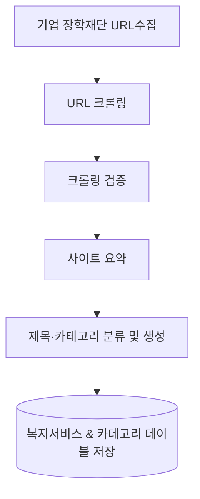

## MCP 복지서비스
* 아래 문서는 Gemini 기반 검색 → Playwright 크롤링 → 검증 → 요약 → 제목·카테고리 생성 → DB 저장 과정을 완전 자동화하는 MCP(메이크업 클라이언트 프로토콜) 시스템을 설치·실행하는 방법을 단계별로 설명합니다.
### 1. 전체 흐름

* **Gemini**: 검색 결과(URL) 반환
* **Playwright**: 각 URL을 depth‑2까지 순회해 제목·본문 스니펫 수집
* **검증**: 페이지가 실제 신청 페이지인지 판단
* **요약**: 300자 이내 핵심 내용
* **제목·카테고리**: Gemini로 제목·카테고리 JSON 생성
* **DB 저장**: PostgreSQL(옵션) 혹은 로컬 파일에 저장

### 2. 사전 준비
| 항목| 최소 요구사항|
| --- | --- |
| Python | 3.10 이상 (CPython) |
| Google Gemini API Key | ✔ |
| Playwright 브라우저 바이너리 | ✔ |
| MySQL(옵션) | ✔ |

> 서버는 DB 없이도 동작합니다. DB를 사용하려면 **DB_HOST** 등 환경 변수를 설정해 주면 됩니다.


## 3. 설치 절차
### 3.1 저장소 복제
```bash
git clone https://github.com/your-org/welfare-mcp.git
cd welfare-mcp
```
### 3.2 가상환경 생성
```bash
python -m venv .venv
source .venv/bin/activate          # Windows : .venv\Scripts\activate
```
### 3.3 의존성 설치
```bash
pip install -r requirements.txt
```
```
requirements.txt
fastmcp
google-generativeai
playwright
sqlalchemy
python-dotenv
```
### 3.4 환경 변수 설정
* 프로젝트 루트에 apikey.env(또는 .env) 파일을 만들어 아래와 같이 입력합니다.
```dotenv
GEMINI_API_KEY=YOUR_GEMINI_API_KEY
GOOGLE_API_KEY=YOUR_GOOGLE_API_KEY   # Gemini이 필요 시
DB_HOST=your-db-host
DB_PORT=5432
DB_USER=your-db-user
DB_PASSWORD=your-db-password
DB_DATABASE=your-db-name
```

### Linux/macOS:
```bash
export $(cat apikey.env | xargs)
```
### Windows(명령 프롬프트):
``` bash
for /f "tokens=* delims=" %i in (apikey.env) do set %i
```
> 환경 변수를 로드한 뒤 바로 python server.py 나 python client.py 를 실행하면 됩니다.
## 3.5 Playwright 브라우저 설치
```bash
playwright install
```
> Playwright는 Chromium/Firefox/ WebKit을 자동으로 다운로드합니다.

---
## 4. MCP 서버 실행
```bash
python server.py
```
* stdio 모드로 실행되며, 표준 입력/출력으로 JSON 요청/응답을 주고받습니다.
* 로그는 **logging.basicConfig(level=logging.INFO)**에 따라 콘솔에 출력됩니다.
* Windows에서는 **asyncio.set_event_loop_policy(asyncio.WindowsProactorEventLoopPolicy())**가 자동으로 적용됩니다.

### 4.1 사용 가능한 도구 목록
|도구명	|역할	|파라미터	|반환값|
|--------|-----------|---------------|--------|
|search_sites_with_gemini	Gemini |검색|	{}	|URL 리스트(JSON 문자열)|
|crawl_from_search	|Playwright 크롤링|	{"urls":[...], "max_depth":2}	|count, data(JSON 문자열)|
|verify_crawled_info	|페이지 검증|	{"title":"...", "snippet":"..."}	|VALID / INVALID|
|summary_info	|300자 이내 요약|	{"title":"...", "snippet":"..."}	|텍스트|
|generate_title_and_category	|제목·카테고리 JSON 생성|	{"summary":"..."}	|JSON|
|generate_title	|레거시용|	{"summary":"...", "url":"..."}	|JSON|
|generate_title_and_category	|카테고리 포함|	{"summary":"...", "url":"..."}	|JSON|
> 클라이언트는 순차적으로 이 도구들을 호출합니다.

## 5. 클라이언트 실행
```bash
python client.py
```
### 클라이언트는 다음 과정을 자동으로 수행합니다.

1. 검색 → URL 10개 (예시) 확보
2. 크롤링 → 각 URL depth‑2까지 탐색, 제목·본문 스니펫 수집
3. 검증 → **verify_crawled_info** 로 신청 페이지인지 판별
4. 요약 → **summary_info** 로 300자 이내 핵심 내용 생성
5. 제목·카테고리 → **generate_title_and_category** 로 JSON 생성
6. DB 저장 (옵션) → 복지서비스 와 카테고리 테이블에 삽입

### 5.1 DB 컬럼 매핑
|DB 컬럼	|출처|
|--------------|------|
|서비스ID	|UUID(20자 랜덤)|
|정책명	|generated_title → 정책명 또는 페이지 제목 fallback|
|링크	|URL|
|지원대상	|빈 문자열 (현제 추출 없음)|
|참고사항	|빈 문자열 (현제 추출 없음)|
|상세내용	|summary_info 300자 요약|
* 카테고리 테이블에는 generated_title JSON의 categories 배열이 삽입됩니다.

### 5.2 로깅
서버의 **log_handler** 콜백이 콘솔에 로그를 출력합니다.

## 6. 코드 저장소
* **server.py** : MCP 서버
* **client.py** : 클라이언트 워크플로우
* **db.py** : SQLAlchemy ORM 모델
* **requirements.txt** : 의존성 목록
* **apikey.env** : 환경 변수 예시

> MIT 라이선스 적용 – 자유롭게 복제·배포 가능.

