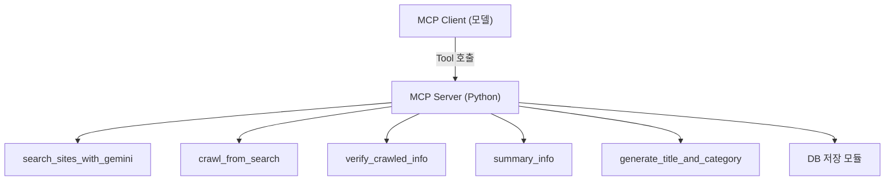
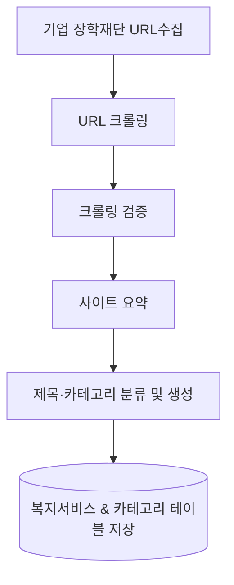

# 정책지원금 통합서비스

##  소개

**정책지원금 통합서비스**는 한국 정부 및 공공기관의 다양한 **정책 지원금(복지, 보조금 등)** 정보를 통합적으로 수집, 분류, 조회 및 추천하는 시스템입니다.
이 서비스는 **공공데이터포털 API**와 **웹 크롤링**을 통해 정책 데이터를 수집하고, **NLP 기반 카테고리 분류 모델**을 활용하여 정책 정보를 자동으로 정리합니다.

사용자는 본 서비스를 통해 본인의 상황(예: 저소득층, 청년, 임산부 등)에 맞는 **맞춤형 정책**을 쉽게 조회할 수 있습니다.

---

##  주요 기능

* **데이터 수집**
  * [공공데이터포털](https://data.go.kr/) API 기반 정책 데이터 자동 수집
  * 정부/지자체/기업 웹사이트 크롤링
  * XML/JSON 파싱 후 통합 DB 저장
  * MCP 기반 크롤링 작업 자동화
    
* **정책 분류**
  * **NLP 기반**: GPT-OSS 모델로 문맥 단위 카테고리 분류
    
* **카테고리 시스템**
  * 총 **27개 복지 카테고리 트리 구조**:
    * 연령별: 임신·출산, 영유아, 아동, 청소년, 노인
    * 사회계층별: 저소득층, 장애인, 농어민, 다문화가정 등
    * 지원유형별: 주거, 생활지원, 교육, 금융, 건강, 안전, 고용 등
    
* **조회 및 추천**
  * 사용자 입력(나이, 소득, 재산, 가족 구성 등)에 따라 정책을 맞춤형으로 추천.
  * 예시:
    * 입력: `소득 100, 나이 25`
    * 출력: 청년·저소득 관련 정책 리스트
      
* **예시 분류**
  * 입력: “개발제한구역 지정으로 생활의 불편을 겪는 구역 내 저소득 주민에게 생활비를 보조합니다.”
    → 출력: `저소득, 생활지원`
  * 입력: “가정 밖 청소년 보호 및 상담 지원”
    → 출력: `청소년, 정신건강, 생활지원, 주거, 교육`

---

##  기술 스택

| 구분           | 사용 기술                                                                             |
| ------------ | --------------------------------------------------------------------------------- |
| **언어**       | Python3.10                                                                            |
| **주요 라이브러리** | FastAPI, FastMCP, BeautifulSoup, ollama, MySQL |
| **NLP 모델**   | GPT-OSS                     |
| **MCP 모델**   | FastMCP                     |
| **환경/도구**    | Ollama (로컬 모델 호스팅)                              |
| **데이터 처리**   | XML/JSON 파싱 → NLP → DB → FastAPI → 사용자                                 |

##  NLP 기반 분류 알고리즘
### 1. 분류 원리
* 입력 문장을 Transformer 기반 모델로 임베딩 후 카테고리별 텍스트와 의미 유사도 계산
* 문맥 단위로 의미를 파악하며 단어 일치 여부에 의존하지 않음
*복수 카테고리가 필요할 경우 상위 N개 카테고리를 쉼표(,)로 출력

| 입력 문장                | 매칭 키워드  | 결과        |
| -------------------- | ------- | --------- |
| "저소득 가정을 위한 주거비 지원"  | 저소득, 주거 | 저소득층, 주거  |
| "임신 중 여성 건강검진 비용 지원" | 임신, 건강  | 임신·출산, 건강 |

---
### 2. 장점
   * 문장 표현 다양성 대응
   * 비정형 문장·서술형 텍스트 처리
   * 유지보수 부담 최소화 (키워드 갱신 불필요)
   *  테고리 추가/변경에 대한 확장성 우수
---
### 3. 단점
   * 모델 크기와 연산량에 따라 속도가 느릴 수 있음
   * 학습 데이터 품질에 따라 정확도 변동
   * 로컬 환경에서는 모델 관리 필요
---
### 4. 모델 구성
   * **모델**: GPT-OSS (로컬 실행 가능)
   * **환경**: Ollama 기반 모델 로딩
   * **API 키**: 환경변수 또는 config.json에서 로드
---
### 5. 실제 분류 예시
| 입력 텍스트 | NLP 분류 결과 |
| ------------------------------- | --------- | 
| 가정 밖 청소년을 보호하고 상담·교육 문화활동을 제공하여 비행 예방 및 사회적응을 지원합니다| 청소년, 정신건강, 주거, 교육, 안전, 생활지원

---

##  [MCP](https://github.com/RealSan1/SocialWelfare/tree/main/MyMCPProject)
  *  **MCP**는 모델과 외부 도구(크롤러, DB, 파일 시스템 등)를 표준화된 인터페이스로 연동하기 위한 경량 프로토콜입니다. 

### 1. MCP 구조

### 2. 전체 흐름

   * **Gemini**: 검색 결과 반환
   * **Playwright**: 각 URL을 순회해 제목·본문 스니펫 수집
   * **검증**: 페이지가 실제 신청 페이지인지 판단
   * **요약**: 300자 이내 핵심 내용
   * **제목·카테고리**: 제목·카테고리 JSON 생성
   * **DB 저장**: 데이터 저장

### 3. MCP 사용 이유 
  * 툴 체이닝에 최적화
  * NLP 모델 기반 자동화 파이프라인 운영 가능
  * 서비스 규모 확장 시 유지보수 비용 감소
  * 로컬 실행 환경(Ollama)과 자연스럽게 연동
  * FastAPI와 별개로 모델 오케스트레이션 레이어 구성 가능
